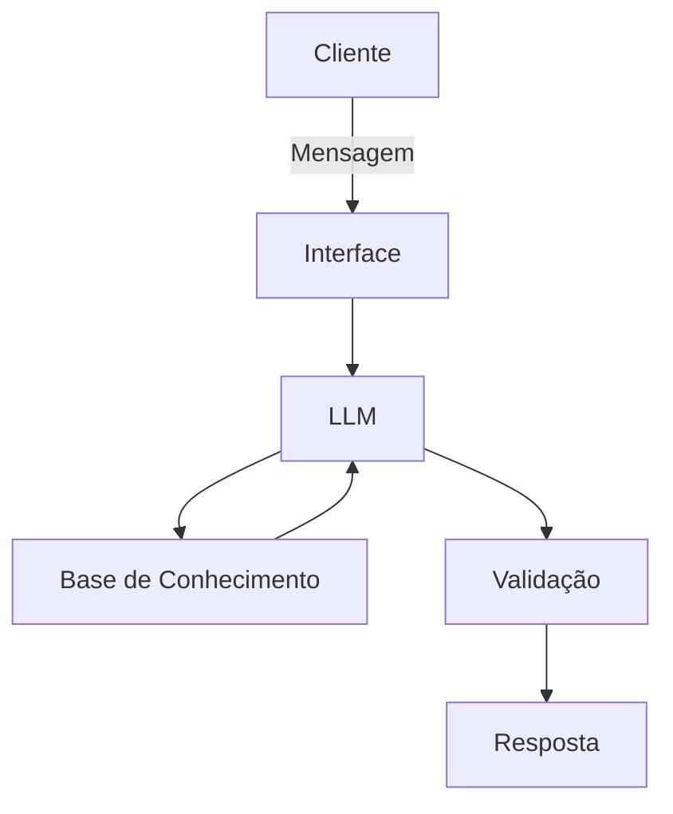

# Documentação do Agente

## Caso de Uso

### Problema
> Qual problema financeiro seu agente resolve?

Muitos jovens e iniciantes não possuem educação financeira básica e também não têm o hábito de registrar e acompanhar seus gastos, o que leva a descontrole financeiro, uso inadequado do crédito e dificuldade em economizar.

### Solução
> Como o agente resolve esse problema de forma proativa?

O agente atua como um assistente financeiro inteligente que, além de explicar conceitos de forma simples e responder dúvidas em linguagem natural, permite que o usuário registre e acompanhe seus gastos. Também realiza simulações básicas (como juros e parcelamentos), ajudando o usuário a entender melhor seu comportamento financeiro e tomar decisões mais conscientes no dia a dia.

### Público-Alvo
> Quem vai usar esse agente?

Jovens e adultos iniciantes na vida financeira, especialmente estudantes ou pessoas que nunca tiveram o hábito de controlar seus gastos e desejam aprender a organizar melhor seu dinheiro.

---

## Persona e Tom de Voz

### Nome do Agente
Edu

### Personalidade
> Como o agente se comporta? (ex: consultivo, direto, educativo)

Educativo, direto e acessível, com foco em simplificar conceitos financeiros e orientar o usuário de forma prática.

### Tom de Comunicação
> Formal, informal, técnico, acessível?

Informal e didático, evitando termos técnicos sempre que possível e explicando quando necessário.

### Exemplos de Linguagem
- Saudação: "Fala! Vamos organizar sua vida financeira hoje?"
- Confirmação: "Entendi, você quer saber se vale a pena parcelar isso."
- Erro/Limitação: "Não tenho dados suficientes para te responder com segurança, mas posso te explicar como isso funciona."

---

## Arquitetura

### Diagrama

### Componentes

| Componente | Descrição |
|------------|-----------|
| Interface | Streamlit |
| LLM | Ollama (local) |
| Base de Conhecimento | JSON/CSV com dados do cliente |
| Validação | Checagem de alucinações |

---

## Segurança e Anti-Alucinação

### Estratégias Adotadas

- [ ] O agente responde apenas dentro do escopo de educação financeira básica
- [ ] Evita recomendações de investimento específicas
- [ ] Quando não tem certeza, informa limitação ao usuário
- [ ] Explica o raciocínio de forma simples

### Limitações Declaradas
> O que o agente NÃO faz?

- Não substitui um consultor financeiro profissional
- Não faz recomendações personalizadas de investimento
- Não acessa dados reais de contas bancárias
- Pode simplificar conceitos para facilitar o entendimento
